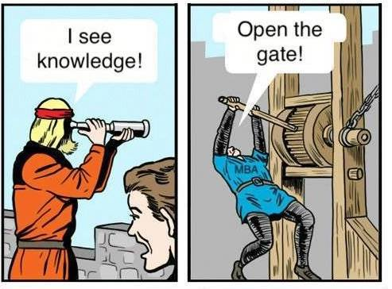
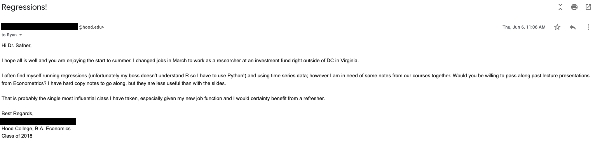
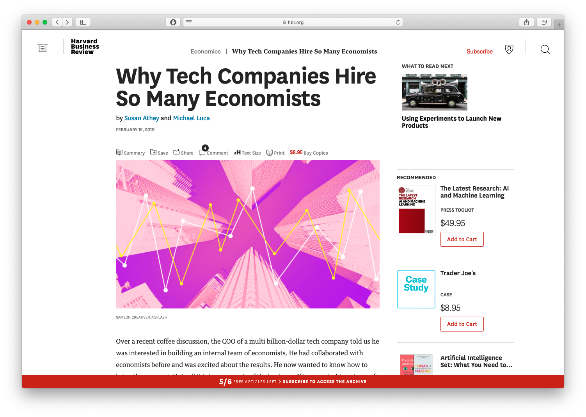

```{r setup, include=FALSE}
options(htmltools.dir.version = FALSE)
knitr::opts_chunk$set(echo=F,
                      message=F,
                      warning=F,
                      fig.retina = 3,
                      fig.align = "center")
library("tidyverse")
library("ggrepel")
library("fontawesome")
xaringanExtra::use_tile_view()
xaringanExtra::use_tachyons()
xaringanExtra::use_freezeframe()

update_geom_defaults("label", list(family = "Fira Sans Condensed"))
update_geom_defaults("text", list(family = "Fira Sans Condensed"))

set.seed(256)

theme_slides <- theme_light() + 
  theme(
    text = element_text(family = "Fira Sans", size = 24)
  )

```

class: inverse, center, middle

# Outline

### [What is Econometrics?]

### [About This Class]

### [Types of Games]

### [About This Course]

------------------------------------------------------------------------

# About Me

.left-column\[ .center\[ \]\]

.right-column\[ .smallest\[\]\]

------------------------------------------------------------------------

# About Me

.left-column\[ .center\[ \]\]

.right-column\[ .smallest\[\]\]

------------------------------------------------------------------------

# The Reason I am Busy AF Behind the Scenes

.center\[ \]

## And why I wear a mask.

class: inverse, center, middle

# What is Econometrics?

------------------------------------------------------------------------

# Why Everyone, Yes *Everyone*, Should Learn Statistics

.pull-left\[ .center\[ \]\]

--

.pull-right\[ .center\[ \]\] ---

# We're Not So Good at Statistics: Votes I

-   Votes in the U.S. House of Representatives in favor of .hi-turquoise\[passing\] the *Civil Rights Act of 1964*:

.left-column\[ \| Democrat \| Republican \| \|----------\|------------\| \| 61% \| 80% \| \]

--

.pull-right\[ - Simple enough: "on average, Republicans tended to vote for passage more than Democrats"\]

------------------------------------------------------------------------

# We're Not So Good at Statistics: Votes II

-   Broken down further by Northern vs. Southern states:

.left-column\[\]

|                                                                                                                                                   |
|----|
| .right-column\[ - Larger proportion of Democrats $(\frac{94}{248}$, 38%) than Republicans $(\frac{10}{172}$, 6%) were from South                  |
| \- The 7% of southern Democrats voting *for* the Act dragged down the Democrats' *overall* percentage more than the 0% of southern Republicans \] |

# We're Not So Good at Statistics: Kidney Stones I

.pull-left\[ - Suppose you suffer from kidney stones, your doctor offers you .hi\[treatment A\] or .hi-purple\[treatment B\]\]

.pull-right\[\] ---

# We're Not So Good at Statistics: Kidney Stones II

.pull-left\[ From a real [medical study](https://www.ncbi.nlm.nih.gov/pmc/articles/PMC1339981/): \]

.source\[C R Charig, D R Webb, S R Payne, and J E Wickham, 1986, "Comparison of treatment of renal calculi by open surgery, percutaneous nephrolithotomy, and extracorporeal shockwave lithotripsy," *Br Med J* (Clin Res Ed) 292(6524): 879--882. \]

--

.pull-right\[ - The *sizes* of the two groups (i.e. who gets A vs B) are *very* different\]

------------------------------------------------------------------------

# We're Not So Good at Statistics: Kidney Stones III

.pull-left\[ .center\[\]\]

.pull-right\[ - The *sizes* of the two groups (i.e. who gets A vs B) are *very* different - A .hi-purple\[lurking variable\] in the study is the severity of the case: doctors tended to give treatment B for less severe cases\]

------------------------------------------------------------------------

# Simpson's Paradox

.pull-left\[ .content-box-red\[\]\] .pull-right\[ .center\[\]\]

------------------------------------------------------------------------

# We're Not so Good at Statistics: Smoking I

.pull-left\[ - 1964: U.S. Surgeon General issued a [report](http://profiles.nlm.nih.gov/ps/access/NNBBMQ.pdf) claiming that cigarette smoking causes lung cancer\] .pull-right\[\]

------------------------------------------------------------------------

# We're Not so Good at Statistics: Smoking II

.pull-left\[ - Tobacco companies attacked the report, naturally\] .pull-right\[\]

------------------------------------------------------------------------

# We're Not so Good at Statistics: Smoking III

.left-column\[ .center\[ \]\] .right-column\[\]

------------------------------------------------------------------------

# We're Not so Good at Statistics: Smoking IV

.pull-left\[ - There could be a confounding variable ("smoking gene") that causes *both* lung cancer *and* the urge to smoke\]

.pull-right\[ .center\[\]\]

------------------------------------------------------------------------

# Correlation Does Not Imply Causation I

-   The goal of every intro statistics class ever

--

.center\[ \]

------------------------------------------------------------------------

# Correlation Does Not Imply Causation II

.center\[ \]

------------------------------------------------------------------------

# Correlation *Can* Imply Causation...

.pull-left\[\]

.pull-right\[\]

------------------------------------------------------------------------

# ...With the Right Tools

.pull-left\[\]

.pull-right\[\]

------------------------------------------------------------------------

# Causal Inference I

.left-column\[ .center\[ \]\]

.right-column\[\]

------------------------------------------------------------------------

# Causal Inference II

.left-column\[ .center\[ \]\]

.right-column\[\]

.footnote\[ .source\[<sup>1</sup> Klick, Jonathan and Alexander Tabarrok, 2005, "Using Terror Alert Levels to Estimate the Effect of Police on Crime," *Journal of Law and Economics* 48(1): 267-279\]\] ---

# Example 1: Education

.pull-left\[ .bg-washed-green.b--dark-green.ba.bw2.br3.shadow-5.ph4.mt5\[ .green\[Does reducing class sizes improve student performance?\]\]\]

.pull-right\[ \]

------------------------------------------------------------------------

# Example 1: Education

.pull-left\[ .bg-washed-green.b--dark-green.ba.bw2.br3.shadow-5.ph4.mt5\[ .green\[Does reducing class sizes improve student performance?\]\]\]

.pull-right\[ \]

------------------------------------------------------------------------

# Example 2: Discrimination in Lending

.pull-left\[ .bg-washed-green.b--dark-green.ba.bw2.br3.shadow-5.ph4.mt5\[ .green\[Is there racial discrimination in home mortgage lending?\]\]\]

.pull-right\[ \]

------------------------------------------------------------------------

# Example 2: Discrimination in Lending

.pull-left\[ .bg-washed-green.b--dark-green.ba.bw2.br3.shadow-5.ph4.mt5\[ .green\[Is there racial discrimination in home mortgage lending?\]\]\]

.pull-right\[ \]

------------------------------------------------------------------------

# Example 3: Public Health and Public Finance

.pull-left\[ .bg-washed-green.b--dark-green.ba.bw2.br3.shadow-5.ph4.mt5\[ .green\[How much do state cigarette taxes reduce smoking rates?\]\]\]

.pull-right\[ \]

------------------------------------------------------------------------

# Example 3: Public Health and Public Finance

.pull-left\[ .bg-washed-green.b--dark-green.ba.bw2.br3.shadow-5.ph4.mt5\[ .green\[How much do state cigarette taxes reduce smoking rates?\]\]\]

.pull-right\[ \]

------------------------------------------------------------------------

class: inverse, center, middle

# About this Class

------------------------------------------------------------------------

# Real Talk I

.center\[ \]

------------------------------------------------------------------------

# Real Talk I

.center\[ \]

------------------------------------------------------------------------

# Real Talk I

.center\[ \]

------------------------------------------------------------------------

# Real Talk II

.pull-left\[ - This will be one of the hardest courses you take at Hood - There will be moments where you have no idea WTF is going on (*this is normal*) - Yes, you can still get an **A**\]

.pull-right\[ .center\[ \]\]

------------------------------------------------------------------------

# This Class Is

.pull-left\[\]

.pull-right\[ .center\[\]\]

------------------------------------------------------------------------

# This Class Is

.pull-left\[\]

--

.pull-right\[\]

------------------------------------------------------------------------

# Prerequisites

-   **Courses**:
    -   ECON 205
    -   ECON 206
    -   ECON 305 or ECON 306
    -   MATH 112 or ECMG 212

--

-   **Math Skills**:
    -   Basic algebra
    -   Probability-ish
    -   Statistics-ish

--

-   **Computer Science Skills**: NONE

------------------------------------------------------------------------

# What You'll Get Out of This Class

.pull-left\[\]

.pull-right\[ .center\[ \]\]

------------------------------------------------------------------------

# This Class Opens Doors

.center\[ \]

------------------------------------------------------------------------

# This Class Gives You a Hybrid of Skills

.pull-left\[\]

.pull-right\[ .center\[\]\] ---

# Data Science I

.pull-left\[ .center\[ \]\] .pull-right\[\]

------------------------------------------------------------------------

# Data Science II

.pull-left\[ .center\[ [Harvard Business Review](https://hbr.org/2012/10/data-scientist-the-sexiest-job-of-the-21st-century)\]\]

.pull-right\[\]

------------------------------------------------------------------------

# R Skills are In Demand

.pull-left\[\]

.pull-right\[ .source\[[Kaggle Data Science Survey 2018](https://www.kaggle.com/kaggle/kaggle-survey-2018)\]\]

------------------------------------------------------------------------

# Yada Yada Machine Learning

.pull-left\[\]

.pull-right\[\]

------------------------------------------------------------------------

# Causal Inference I

.pull-left\[ - Machine learning and artificial intelligence are "dumb"<sup>1</sup> - With the right models and research designs, we *can* say "X causes Y" and quantify it! - Economists are in a unique position to make *causal* claims that mere statistics cannot\]

.pull-right\[ \]

## .footnote\[<sup>1</sup> For more, see [my blog post](https://ryansafner.com/post/econometrics-data-science-and-causal-inference/), and Pearl & MacKenzie (2018), *The Book of Why*\]

# Causal Inference II

.pull-left\[ .center\[  [Harvard Business Review](https://hbr.org/2019/02/why-tech-companies-hire-so-many-economists)\]\] .pull-right\[\]

------------------------------------------------------------------------

# Building Good Workflow Habits

.pull-left\[\]

.pull-right\[\]

------------------------------------------------------------------------

# A Quick Example

.left-code\[\]

.right-plot\[ .center\[\]\] ---

# Assignments

.pull-left\[\]

.pull-right\[ .center\[\]\]

------------------------------------------------------------------------

# Your "Textbooks"

.pull-left\[ .center\[ \]\] .pull-right\[ .center\[ \]\]

------------------------------------------------------------------------

# Logistics

.pull-left\[ .smallest\[\]\]

.pull-right\[ .center\[ \]\]

------------------------------------------------------------------------

class: inverse, center, middle

# You Can Do This.

------------------------------------------------------------------------

# Tips for Success In This Course

.pull-left\[ - *Take notes. On paper. Really.*\]

.pull-right\[ .center\[ \]\]

.footnote\[<sup>1</sup> A properly worded Google search will become your secret weapon. Believe me. It's still mine.\]

------------------------------------------------------------------------

# Course Website

.center\[ \]

------------------------------------------------------------------------

# Roadmap for the Semester

.center\[ \]
